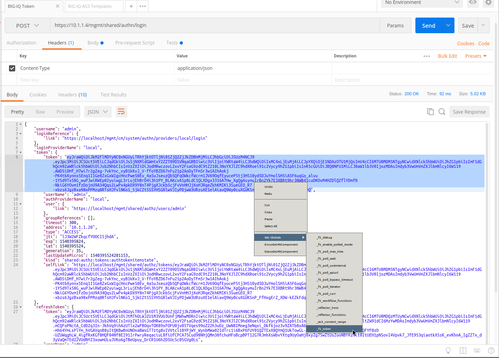
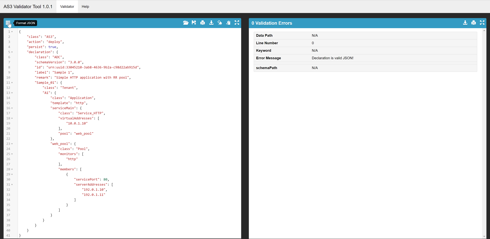
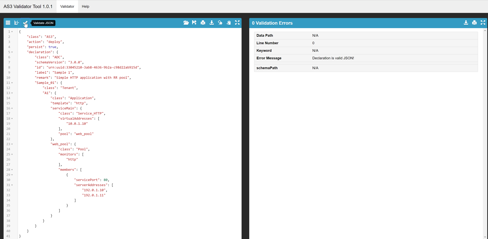

Lab 4.1: Sending AS3 declaration through BIG-IQ 6.1
---------------------------------------------------

Using the declarative AS3 API, let's send the following BIG-IP configuration through BIG-IQ:

#. Using Postman select ``Step 1: Retrieve Authentication Token``. Review the
   **Request** JSON :guilabel:`Body`. The JSON body is used to get the Auth
   token from BIG-IQ. Press Send.

|lab-4-1|

Task 1 - HTTP Application Service
~~~~~~~~~~~~~~~~~~~~~~~~~~~~~~~~~

#. Select the `Example 1 Simple HTTP application`_ from AS3 cloud docs and past it in the AS3 public validator.

.. _Example 1 Simple HTTP application: https://clouddocs.f5.com/products/extensions/f5-appsvcs-extension/3/userguide/examples.html

To access to the AS3 public validator, go to the Linux Jumphost, open a browser and connect to http://localhost:5000

#. Click on ``Format JSON`` on the top left.

|lab-4-2|

#. Click on ``Validate JSON`` and ``Validate AS3 Declaration``. Make sure the Declaration is valid!

|lab-4-3|

#. Now that the JSON is validated, let's add the targetHost (BIG-IQ) and the traget (BIG-IP device)

Add target host information under the action:

    "targetHost": "10.1.1.4",
    "targetPort": 443,
    "targetUsername": "admin",
    "targetPassphrase": "admin",

Add the target information before the tenant application:

    "target": {
        "hostname": "ip-10-1-1-10.us-west-2.compute.internal"
    },

Modify the Virtual Address to 10.1.20.100 and the serverAddresses to 10.1.10.100 to 10.1.10.104.

#. Click on  ``Format JSON``, ``Validate JSON`` and ``Validate AS3 Declaration``. Make sure the Declaration is valid!

#. Now, the validaiton is valid, post the declaration into Postman.

#. Logon on BIG-IQ, go to Application tab and check the application is displayed and analytics are showing.

|lab-4-4|

Task 2 - HTTPS Offload
~~~~~~~~~~~~~~~~~~~~~~

Repeat Task 1 with `Example 2 HTTPS application`_ from AS3 cloud docs.

.. _Example 2 HTTPS application: https://clouddocs.f5.com/products/extensions/f5-appsvcs-extension/3/userguide/examples.html#example-2-https-application

Modify the Virtual Address to 10.1.20.101 and the serverAddresses to 10.1.10.100 to 10.1.10.104.

Task 3 - Web Application Firewall (ASM)
~~~~~~~~~~~~~~~~~~~~~~~~~~~~~~~~~~~~~~~

Repeat Task 1 with `1 Virtual service referencing an existing security policy`_ from AS3 cloud docs.

.. _1 Virtual service referencing an existing security policy: https://clouddocs.f5.com/products/extensions/f5-appsvcs-extension/3/declarations/security-related.html#virtual-service-referencing-an-existing-security-policy

Modify the Virtual Address to 10.1.20.102 and the serverAddresses to 10.1.10.100 to 10.1.10.104.

Task 4 - Generic Services
~~~~~~~~~~~~~~~~~~~~~~~~~

Modify the Virtual Address to 10.1.20.103, port 1000 and the serverAddresses to 10.1.10.100 to 10.1.10.104.

.. |lab-4-4| image:: images/lab-4-4.png
