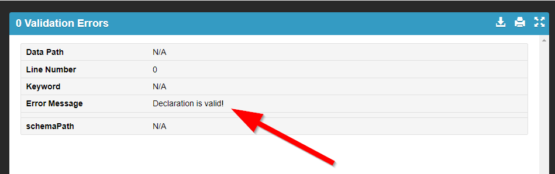

Lab 4.1: Sending AS3 declaration through BIG-IQ 6.1
---------------------------------------------------

Using the declarative AS3 API, let's send the following BIG-IP configuration through BIG-IQ:

#. Using Postman select ``BIG-IQ Token`` available in the Collections.
Press Send. Then, select the token value, click right, Set Globals, _f5_token.

|lab-1-1|

Task 1 - HTTP Application Service
~~~~~~~~~~~~~~~~~~~~~~~~~~~~~~~~~

#. Copy below example of an AS3 Declaration into the AS3 public validator.

.. code-block:: yaml
   :linenos:
   :emphasize-lines: 8,19

    {
        "class": "AS3",
        "action": "deploy",
        "targetHost": "<big-iq>",
        "targetPort": 443,
        "targetUsername": "<user>",
        "targetPassphrase": "<password>",
        "persist": true,
        "declaration": {
            "class": "ADC",
            "schemaVersion": "3.6.0",
            "id": "example-declaration-01",
            "label": "Task1",
            "remark": "Task 1 - HTTP Application Service",
            "target": {
                "hostname": "<hostname>"
            },
            "Task1": {
                "class": "Tenant",
                "MyWebApp1": {
                    "class": "Application",
                    "template": "http",
                    "serviceMain": {
                        "class": "Service_HTTP",
                        "virtualAddresses": [
                            "<virtual>"
                        ],
                        "pool": "web_pool"
                    },
                    "web_pool": {
                        "class": "Pool",
                        "monitors": [
                            "http"
                        ],
                        "members": [
                            {
                                "servicePort": 80,
                                "serverAddresses": [
                                    "<node1>",
                                    "<node2>"
                                ]
                            }
                        ]
                    }
                }
            }
        }
    }

To access to the AS3 public validator, go to the Linux Jumphost, open a browser and connect to http://localhost:5000 (or use UDP public IP).

#. Click on ``Format JSON`` on the top left.

|lab-1-2|

#. Click on ``Validate JSON`` and ``Validate AS3 Declaration``. Make sure the Declaration is valid!

#. Now that the JSON is validated, let's add the targetHost (BIG-IQ) and the traget (BIG-IP device)

Add target host information under the action::

    "targetHost": "10.1.1.4",
    "targetPort": 443,
    "targetUsername": "olivia",
    "targetPassphrase": "olivia",

Add the target information before the tenant application::

    "target": {
        "hostname": "ip-10-1-1-10.us-west-2.compute.internal"
    },

.. note:: The target BIG-IP is standlone but it could be configured as an HA pair.
          If you want, configure the HA in auto-scync mode. Configure the BIG-IP cluster in BIG-IQ.
          The target in this case can be either device.

Modify the Virtual Address to 10.1.20.100 and the serverAddresses from 10.1.10.100 to 10.1.10.104.

#. Click on  ``Format JSON``, ``Validate JSON`` and ``Validate AS3 Declaration``. Make sure the Declaration is valid!

#. Using Postman, use the **BIG-IQ AS3 Declaration** collection in order to create the service on the BIG-IP through BIG-IQ. Copy/Past the declaration into Postman.

    POST https://10.1.1.4/mgmt/shared/appsvcs/declare

.. note:: https://10.1.1.4/mgmt/shared/appsvcs/declare?async=true
          his will give you an ID which you can query in the task section 
          https://10.1.1.4/mgmt/shared/appsvcs/task/4ad9a50c-d3f6-4110-a26d-e7e100e38da9

Use the **BIG-IQ Check AS3 deployment** collection to ensure that the AS3 deployment is successfull without errors: 

    GET https://10.1.1.4/mgmt/cm/global/tasks/deploy-app-service

#. Logon on BIG-IP and verifiy the Application is correctly deployed.

#. Logon on BIG-IQ as Olivia, go to Application tab and check the application is displayed and analytics are showing.

|lab-1-3|

Task 2 - HTTPS Offload
~~~~~~~~~~~~~~~~~~~~~~

Repeat steps from Task 1 with  below example.

Modify the Virtual Address to 10.1.20.101 and the serverAddresses from 10.1.10.100 to 10.1.10.104.

.. code-block:: yaml
   :linenos:
   :emphasize-lines: 8,19

    {
        "class": "AS3",
        "action": "deploy",
        "targetHost": "<big-iq>",
        "targetPort": 443,
        "targetUsername": "<user>",
        "targetPassphrase": "<password>",
        "persist": true,
        "declaration": {
            "class": "ADC",
            "schemaVersion": "3.6.0",
            "id": "isc-lab",
            "label": "Task2",
            "remark": "Task 2 - HTTPS Application Service",
            "target": {
                "hostname": "<hostname>"
            },
            "Task2": {
                "class": "Tenant",
                "MyWebApp2": {
                    "class": "Application",
                    "template": "https",
                    "serviceMain": {
                        "class": "Service_HTTPS",
                        "virtualAddresses": [
                            "<virtual>"
                        ],
                        "pool": "web_pool",
                        "serverTLS": "webtls"
                    },
                    "web_pool": {
                        "class": "Pool",
                        "monitors": [
                            "http"
                        ],
                        "members": [
                            {
                                "servicePort": 80,
                                "serverAddresses": [
                                    "<node1>",
                                    "<node2>"
                                ]
                            }
                        ]
                    },
                    "webtls": {
                        "class": "TLS_Server",
                        "certificates": [
                            {
                                "certificate": "webcert"
                            }
                        ]
                    },
                    "webcert": {
                        "class": "Certificate",
                        "certificate": {
                            "bigip": "/Common/default.crt"
                        },
                        "privateKey": {
                            "bigip": "/Common/default.key"
                        }
                    }
                }
            }
        }
    }

Task 3 - HTTPS Application with Web Application Firewall
~~~~~~~~~~~~~~~~~~~~~~~~~~~~~~~~~~~~~~~~~~~~~~~~~~~~~~~~

Repeat steps from Task 1 with  below example.

Modify the Virtual Address to 10.1.20.102 and the serverAddresses from 10.1.10.100 to 10.1.10.104.

Update the WAF policy with the policy available on BIG-IP::

 "policyWAF": {
          "bigip": "/Common/linux-high"
        }

.. code-block:: yaml
   :linenos:
   :emphasize-lines: 8,19

    {
        "class": "AS3",
        "action": "deploy",
        "targetHost": "<big-iq>",
        "targetPort": 443,
        "targetUsername": "<user>",
        "targetPassphrase": "<password>",
        "persist": true,
        "declaration": {
            "class": "ADC",
            "schemaVersion": "3.6.0",
            "id": "isc-lab",
            "label": "Task3",
            "remark": "Task 3 - HTTPS Application with WAF",
            "target": {
                "hostname": "<hostname>"
            },
            "Task3": {
                "class": "Tenant",
                "MyWebApp3": {
                    "class": "Application",
                    "template": "https",
                    "serviceMain": {
                        "class": "Service_HTTPS",
                        "virtualAddresses": [
                            "<virtual>"
                        ],
                        "pool": "web_pool",
                        "serverTLS": "webtls",
                        "policyWAF": {
                            "bigip": "/Common/<ASM policy>"
                        }
                    },
                    "web_pool": {
                        "class": "Pool",
                        "monitors": [
                            "http"
                        ],
                        "members": [
                            {
                                "servicePort": 80,
                                "serverAddresses": [
                                    "<node1>",
                                    "<node2>"
                                ]
                            }
                        ]
                    },
                    "webtls": {
                        "class": "TLS_Server",
                        "certificates": [
                            {
                                "certificate": "webcert"
                            }
                        ]
                    },
                    "webcert": {
                        "class": "Certificate",
                        "certificate": {
                            "bigip": "/Common/default.crt"
                        },
                        "privateKey": {
                            "bigip": "/Common/default.key"
                        }
                    }
                }
            }
        }
    }

Task 4 - Generic Services
~~~~~~~~~~~~~~~~~~~~~~~~~

Repeat steps from Task 1 with  below example.

.. note:: Note that because this declaration uses the generic template, the service does not have to be named serviceMain

Modify the Generic virtual with something other than ServiceMain, Virtual Address to 10.1.20.103, port 8080 and add the pool and the serverAddresses from 10.1.10.100 to 10.1.10.104.

.. code-block:: yaml
   :linenos:
   :emphasize-lines: 8,19

    {
        "class": "AS3",
        "action": "deploy",
        "targetHost": "<big-iq>",
        "targetPort": 443,
        "targetUsername": "<user>",
        "targetPassphrase": "<password>",
        "persist": true,
        "declaration": {
            "class": "ADC",
            "schemaVersion": "3.6.0",
            "id": "isc-lab",
            "label": "Task4",
            "remark": "Task 4 - Generic Services",
            "target": {
                "hostname": "<hostname>"
            },
            "Task4": {
            "class": "Tenant",
            "MyWebApp4": {
                "class": "Application",
                "template": "generic",
                "<generic_virtual>": {
                    "class": "Service_Generic",
                    "virtualAddresses": [
                        "<virtual>"
                    ],
                    "virtualPort": 8080,
                    "pool": "web_pool"
                },
                "web_pool": {
                    "class": "Pool",
                    "monitors": [
                        "tcp"
                    ],
                    "members": [
                        {
                            "servicePort": 80,
                            "serverAddresses": [
                                "<node1>",
                                "<node2>"
                            ]
                        }
                    ]
                }
            }
        }
        }
    }

.. |lab-1-3| image:: images/lab-1-3.png
   :scale: 80%
