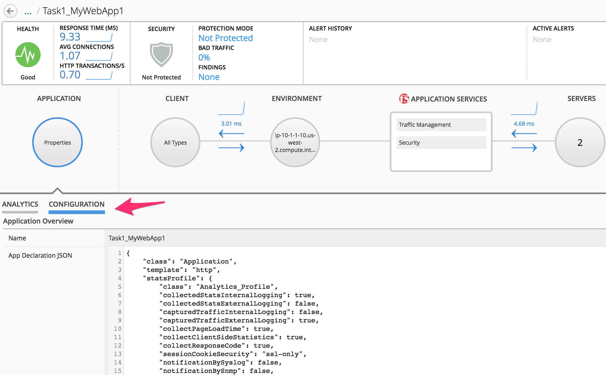

Lab 4.1: Sending AS3 declaration through BIG-IQ 6.1
---------------------------------------------------

Connect to the **Linux Jumphost** and open Chrome and Postman (wait ~2 minutes).

Using the declarative AS3 API, let's send the following BIG-IP configuration through BIG-IQ:

Using Postman select ``BIG-IQ Token`` available in the Collections.
Press Send. This, will save the token value as _f5_token. If your token expires, obtain a new token by resending the ``BIG-IQ Token``

..note:: The token timeout is set to 5 min. If you get the 401 authorization error, request a new token.

|lab-1-1|

Task 1 - HTTP Application Service
~~~~~~~~~~~~~~~~~~~~~~~~~~~~~~~~~

1. Copy below example of an AS3 Declaration into the AS3 validator. The AS3 validator is your IDE.

.. code-block:: yaml
   :linenos:
   :emphasize-lines: 12,33,49,50

   {
       "class": "AS3",
       "action": "deploy",
       "persist": true,
       "declaration": {
           "class": "ADC",
           "schemaVersion": "3.7.0",
           "id": "example-declaration-01",
           "label": "Task1",
           "remark": "Task 1 - HTTP Application Service",
           "target": {
               "hostname": "<hostname>"
           },
           "Task1": {
               "class": "Tenant",
               "MyWebApp1": {
                   "class": "Application",
                   "template": "http",
                   "statsProfile": {
                       "class": "Analytics_Profile",
                       "collectedStatsInternalLogging": true,
                       "collectedStatsExternalLogging": false,
                       "capturedTrafficInternalLogging": false,
                       "capturedTrafficExternalLogging": true,
                       "collectPageLoadTime": true,
                       "collectClientSideStatistics": true,
                       "collectResponseCode": true,
                       "sessionCookieSecurity": "ssl-only"
                   },
                   "serviceMain": {
                       "class": "Service_HTTP",
                       "virtualAddresses": [
                           "<virtual>"
                       ],
                       "pool": "web_pool",
                       "profileAnalytics": {
                           "use": "statsProfile"
                       }
                   },
                   "web_pool": {
                       "class": "Pool",
                       "monitors": [
                           "http"
                       ],
                       "members": [
                           {
                               "servicePort": 80,
                               "serverAddresses": [
                                   "<node1>",
                                   "<node2>"
                               ]
                           }
                       ]
                   }
               }
           }
       }
   }

To access to the AS3 public validator, go to the Linux Jumphost, open a browser and connect to http://10.1.1.15:5000

2. Click on ``Format JSON`` on the top left.

3. Click on ``Validate JSON`` and ``Validate AS3 Declaration``. Make sure the Declaration is valid!

|lab-1-2|

.. note:: Ignore the schemaVersion error. Note the schema validator is using AS3.6 and we are using AS3.7.

4. Now that the JSON is validated, let's add the target (BIG-IP device)::

    "target": {
        "hostname": "ip-10-1-1-10.us-west-2.compute.internal"
    },

.. note:: The target BIG-IP is standalone but it could be configured as an HA pair.
          If you want, configure the HA in auto-sync mode. Configure the BIG-IP cluster in BIG-IQ.
          The target in this case can be either device.

Modify the Virtual Address to 10.1.20.100 and the serverAddresses to 10.1.10.100 and 10.1.10.101.

5. Click on  ``Format JSON``, ``Validate JSON`` and ``Validate AS3 Declaration``. Make sure the Declaration is valid!

6. Using Postman, use the **BIG-IQ AS3 Declaration** collection in order to create the service on the BIG-IP through BIG-IQ.
Copy/Paste the AS3 declaration from the validator to the declaration body into Postman.

   POST https://10.1.1.4/mgmt/shared/appsvcs/declare?async=true
   
   This will give you an ID which you can query using the **BIG-IQ Check AS3 Deployment Task**

7. Use the **BIG-IQ Check AS3 Deployment Task** and **BIG-IQ Check AS3 Deployment** collections to ensure that the AS3 deployment is successfull without errors: 

   GET https://10.1.1.4/mgmt/shared/appsvcs/task/<id>
   
   GET https://10.1.1.4/mgmt/cm/global/tasks/deploy-app-service

8. Logon on **BIG-IP A** and verify the Application is correctly deployed in partition Task1.

9. Logon on **BIG-IQ** as admin, go to Application tab and check the application is displayed and analytics are showing.

|lab-1-3|

Click on your Application, Properties > CONFIGURATION, look at AS3 Declaration.

|lab-1-4|

Task 2 - HTTPS Offload
~~~~~~~~~~~~~~~~~~~~~~

Now we are going to create another service but this time SSL offload environment.

1. Using Postman, use the **BIG-IQ AS3 Declaration** collection in order to create the service on the BIG-IP through BIG-IQ.
Copy/Paste the below AS3 declaration from the validator to the declaration body into Postman.

   POST https://10.1.1.4/mgmt/shared/appsvcs/declare?async=true
   
   This will give you an ID which you can query using the **BIG-IQ Check AS3 Deployment Task**

.. code-block:: yaml
   :linenos:
   :emphasize-lines: 12,33,50,51

   {
       "class": "AS3",
       "action": "deploy",
       "persist": true,
       "declaration": {
           "class": "ADC",
           "schemaVersion": "3.7.0",
           "id": "isc-lab",
           "label": "Task2",
           "remark": "Task 2 - HTTPS Application Service",
           "target": {
               "hostname": "ip-10-1-1-10.us-west-2.compute.internal"
           },
           "Task2": {
               "class": "Tenant",
               "MyWebApp2": {
                   "class": "Application",
                   "template": "https",
                   "statsProfile": {
                       "class": "Analytics_Profile",
                       "collectedStatsInternalLogging": true,
                       "collectedStatsExternalLogging": false,
                       "capturedTrafficInternalLogging": false,
                       "capturedTrafficExternalLogging": true,
                       "collectPageLoadTime": true,
                       "collectClientSideStatistics": true,
                       "collectResponseCode": true,
                       "sessionCookieSecurity": "ssl-only"
                   },
                   "serviceMain": {
                       "class": "Service_HTTPS",
                       "virtualAddresses": [
                           "10.1.20.101"
                       ],
                       "pool": "web_pool",
                       "profileAnalytics": {
                           "use": "statsProfile"
                       },
                       "serverTLS": "webtls"
                   },
                   "web_pool": {
                       "class": "Pool",
                       "monitors": [
                           "http"
                       ],
                       "members": [
                           {
                               "servicePort": 80,
                               "serverAddresses": [
                                   "10.1.10.103",
                                   "10.1.10.104"
                               ]
                           }
                       ]
                   },
                   "webtls": {
                       "class": "TLS_Server",
                       "certificates": [
                           {
                               "certificate": "webcert"
                           }
                       ]
                   },
                   "webcert": {
                       "class": "Certificate",
                       "certificate": {
                           "bigip": "/Common/default.crt"
                       },
                       "privateKey": {
                           "bigip": "/Common/default.key"
                       }
                   }
               }
           }
       }
   }

2. Use the **BIG-IQ Check AS3 Deployment Task** and **BIG-IQ Check AS3 Deployment** collections to ensure that the AS3 deployment is successfull without errors: 

   GET https://10.1.1.4/mgmt/shared/appsvcs/task/<id>
   
   GET https://10.1.1.4/mgmt/cm/global/tasks/deploy-app-service

Task 3 - HTTPS Application with Web Application Firewall
~~~~~~~~~~~~~~~~~~~~~~~~~~~~~~~~~~~~~~~~~~~~~~~~~~~~~~~~

Update the WAF policy with the policy available on BIG-IP::

 "policyWAF": {
          "bigip": "/Common/linux-high"
        }

.. code-block:: yaml
   :linenos:
   :emphasize-lines: 12,33,41,53,54

   {
       "class": "AS3",
       "action": "deploy",
       "persist": true,
       "declaration": {
           "class": "ADC",
           "schemaVersion": "3.7.0",
           "id": "isc-lab",
           "label": "Task3",
           "remark": "Task 3 - HTTPS Application with WAF",
           "target": {
               "hostname": "ip-10-1-1-10.us-west-2.compute.internal"
           },
           "Task3": {
               "class": "Tenant",
               "MyWebApp3": {
                   "class": "Application",
                   "template": "https",
                   "statsProfile": {
                       "class": "Analytics_Profile",
                       "collectedStatsInternalLogging": true,
                       "collectedStatsExternalLogging": false,
                       "capturedTrafficInternalLogging": false,
                       "capturedTrafficExternalLogging": true,
                       "collectPageLoadTime": true,
                       "collectClientSideStatistics": true,
                       "collectResponseCode": true,
                       "sessionCookieSecurity": "ssl-only"
                   },
                   "serviceMain": {
                       "class": "Service_HTTPS",
                       "virtualAddresses": [
                           "10.1.20.102"
                       ],
                       "pool": "web_pool",
                       "profileAnalytics": {
                           "use": "statsProfile"
                       },
                       "serverTLS": "webtls",
                       "policyWAF": {
                           "bigip": "/Common/<ASM policy>"
                       }
                   },
                   "web_pool": {
                       "class": "Pool",
                       "monitors": [
                           "http"
                       ],
                       "members": [
                           {
                               "servicePort": 80,
                               "serverAddresses": [
                                   "10.1.10.105",
                                   "10.1.10.106"
                               ]
                           }
                       ]
                   },
                   "webtls": {
                       "class": "TLS_Server",
                       "certificates": [
                           {
                               "certificate": "webcert"
                           }
                       ]
                   },
                   "webcert": {
                       "class": "Certificate",
                       "certificate": {
                           "bigip": "/Common/default.crt"
                       },
                       "privateKey": {
                           "bigip": "/Common/default.key"
                       }
                   }
               }
           }
       }
   }

1. Using Postman, use the **BIG-IQ AS3 Declaration** collection in order to create the service on the BIG-IP through BIG-IQ.
Copy/Paste the above AS3 declaration from the validator to the declaration body into Postman.

   POST https://10.1.1.4/mgmt/shared/appsvcs/declare?async=true
   
   This will give you an ID which you can query using the **BIG-IQ Check AS3 Deployment Task**

2. Use the **BIG-IQ Check AS3 Deployment Task** and **BIG-IQ Check AS3 Deployment** collections to ensure that the AS3 deployment is successfull without errors: 

   GET https://10.1.1.4/mgmt/shared/appsvcs/task/<id>
   
   GET https://10.1.1.4/mgmt/cm/global/tasks/deploy-app-service

Task 4 - Generic Services
~~~~~~~~~~~~~~~~~~~~~~~~~

.. note:: Note that because this declaration uses the generic template, the service does not have to be named serviceMain

Modify the Generic virtual with something other than <generic_virtual>.

.. code-block:: yaml
   :linenos:
   :emphasize-lines: 12,30,33,35,50,51

   {
       "class": "AS3",
       "action": "deploy",
       "persist": true,
       "declaration": {
           "class": "ADC",
           "schemaVersion": "3.7.0",
           "id": "isc-lab",
           "label": "Task4",
           "remark": "Task 4 - Generic Services",
           "target": {
               "hostname": "ip-10-1-1-10.us-west-2.compute.internal"
           },
           "Task4": {
               "class": "Tenant",
               "MyWebApp4": {
                   "class": "Application",
                   "template": "generic",
                   "statsProfile": {
                       "class": "Analytics_Profile",
                       "collectedStatsInternalLogging": true,
                       "collectedStatsExternalLogging": false,
                       "capturedTrafficInternalLogging": false,
                       "capturedTrafficExternalLogging": true,
                       "collectPageLoadTime": true,
                       "collectClientSideStatistics": true,
                       "collectResponseCode": true,
                       "sessionCookieSecurity": "ssl-only"
                   },
                   "<generic_virtual>": {
                       "class": "Service_Generic",
                       "virtualAddresses": [
                           "10.1.20.103"
                       ],
                       "virtualPort": 8080,
                       "pool": "web_pool",
                       "profileAnalytics": {
                           "use": "statsProfile"
                       }
                   },
                   "web_pool": {
                       "class": "Pool",
                       "monitors": [
                           "tcp"
                       ],
                       "members": [
                           {
                               "servicePort": 80,
                               "serverAddresses": [
                                   "10.1.10.107",
                                   "10.1.10.108"
                               ]
                           }
                       ]
                   }
               }
           }
       }
   }

1. Using Postman, use the **BIG-IQ AS3 Declaration** collection in order to create the service on the BIG-IP through BIG-IQ.
Copy/Paste the above AS3 declaration from the validator to the declaration body into Postman.

   POST https://10.1.1.4/mgmt/shared/appsvcs/declare?async=true
   
   This will give you an ID which you can query using the **BIG-IQ Check AS3 Deployment Task**

2. Use the **BIG-IQ Check AS3 Deployment Task** and **BIG-IQ Check AS3 Deployment** collections to ensure that the AS3 deployment is successfull without errors: 

   GET https://10.1.1.4/mgmt/shared/appsvcs/task/<id>
   
   GET https://10.1.1.4/mgmt/cm/global/tasks/deploy-app-service

.. |lab-1-1| image:: images/lab-1-1.png
   :scale: 80%
.. |lab-1-2| image:: images/lab-1-2.png
   :scale: 80%
.. |lab-1-3| image:: images/lab-1-3.png
   :scale: 80%
