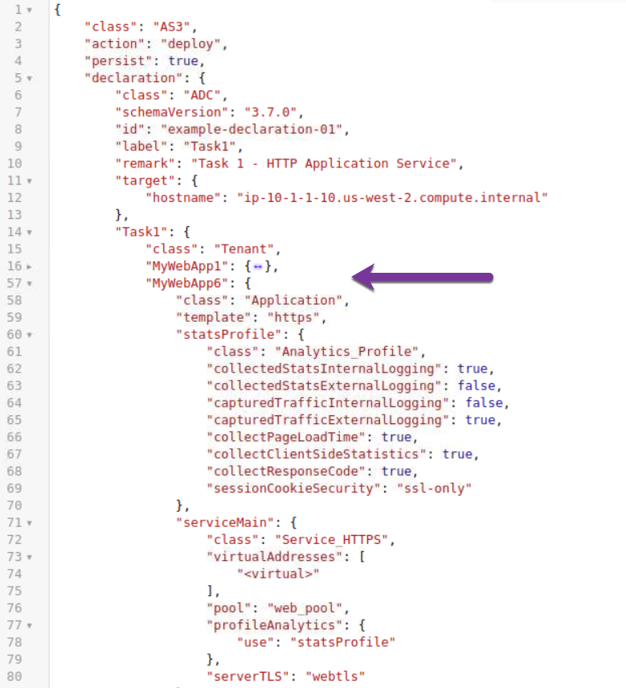

Lab 4.2: Modify AS3 Declaration using BIG-IQ 6.1
------------------------------------------------

Using the declarative AS3 API, let's modfiy the HTTP application created during the previous **lab 1 - Task 1** through BIG-IQ using an updated AS3 declaration.

Task 5 - Add an HTTPS Application to existing HTTP AS3 Declaration
~~~~~~~~~~~~~~~~~~~~~~~~~~~~~~~~~~~~~~~~~~~~~~~~~~~~~~~~~~~~~~~~~~

1. Start with the previous AS3 Declaration from **lab 1 - Task 1**

.. code-block:: yaml
   :linenos:

   {
       "class": "AS3",
       "action": "deploy",
       "persist": true,
       "declaration": {
           "class": "ADC",
           "schemaVersion": "3.7.0",
           "id": "example-declaration-01",
           "label": "Task1",
           "remark": "Task 1 - HTTP Application Service",
           "target": {
               "hostname": "ip-10-1-1-10.us-west-2.compute.internal"
           },
           "Task1": {
               "class": "Tenant",
               "MyWebApp1": {
                   "class": "Application",
                   "template": "http",
                   "statsProfile": {
                       "class": "Analytics_Profile",
                       "collectedStatsInternalLogging": true,
                       "collectedStatsExternalLogging": false,
                       "capturedTrafficInternalLogging": false,
                       "capturedTrafficExternalLogging": true,
                       "collectPageLoadTime": true,
                       "collectClientSideStatistics": true,
                       "collectResponseCode": true,
                       "sessionCookieSecurity": "ssl-only"
                   },
                   "serviceMain": {
                       "class": "Service_HTTP",
                       "virtualAddresses": [
                           "10.1.20.100"
                       ],
                       "pool": "web_pool",
                       "profileAnalytics": {
                           "use": "statsProfile"
                       }
                   },
                   "web_pool": {
                       "class": "Pool",
                       "monitors": [
                           "http"
                       ],
                       "members": [
                           {
                               "servicePort": 80,
                               "serverAddresses": [
                                   "10.1.10.100",
                                   "10.1.10.101"
                               ]
                           }
                       ]
                   }
               }
           }
       }
   }

2. Add the below application service to the existing AS3 declaration in the validator.
Modify the Virtual Address to 10.1.20.104 and the serverAddresses to 10.1.10.109 to 10.1.10.110.

..note:: Add a **","** before the declaration of MyWebApp6.

|lab-2-1|

.. code-block:: yaml
   :linenos:
   :emphasize-lines: 18,35,36

   "MyWebApp6": {
           "class": "Application",
           "template": "https",
           "statsProfile": {
               "class": "Analytics_Profile",
               "collectedStatsInternalLogging": true,
               "collectedStatsExternalLogging": false,
               "capturedTrafficInternalLogging": false,
               "capturedTrafficExternalLogging": true,
               "collectPageLoadTime": true,
               "collectClientSideStatistics": true,
               "collectResponseCode": true,
               "sessionCookieSecurity": "ssl-only"
           },
           "serviceMain": {
               "class": "Service_HTTPS",
               "virtualAddresses": [
                   "<virtual>"
               ],
               "pool": "web_pool",
               "profileAnalytics": {
                   "use": "statsProfile"
               },
               "serverTLS": "webtls"
           },
           "web_pool": {
               "class": "Pool",
               "monitors": [
                   "http"
               ],
               "members": [
                   {
                       "servicePort": 80,
                       "serverAddresses": [
                           "<node9>",
                           "<node10>"
                       ]
                   }
               ]
           },
           "webtls": {
               "class": "TLS_Server",
               "certificates": [
                   {
                       "certificate": "webcert"
                   }
               ]
           },
           "webcert": {
               "class": "Certificate",
               "certificate": {
                   "bigip": "/Common/default.crt"
               },
               "privateKey": {
                   "bigip": "/Common/default.key"
               }
           }
       }

To access to the AS3 public validator, go to the Linux Jumphost, open a browser and connect to http://10.1.1.14:5000

4. Click on ``Format JSON`` on the top left.

5. Click on ``Validate JSON`` and ``Validate AS3 Declaration``. Make sure the Declaration is valid!

6. Click on  ``Format JSON``, ``Validate JSON`` and ``Validate AS3 Declaration``. Make sure the Declaration is valid!

7. Using Postman, use the **BIG-IQ AS3 Declaration** collection in order to create the service on the BIG-IP through BIG-IQ. Copy/Past the declaration into Postman.

   POST https://10.1.1.4/mgmt/shared/appsvcs/declare?async=true
   
   This will give you an ID which you can query using the **BIG-IQ Check AS3 Deployment Task**

8. Use the **BIG-IQ Check AS3 Deployment Task** and **BIG-IQ Check AS3 Deployment** collections to ensure that the AS3 deployment is successfull without errors: 

   GET https://10.1.1.4/mgmt/shared/appsvcs/task/<id>
   
   GET https://10.1.1.4/mgmt/cm/global/tasks/deploy-app-service

9. Logon on BIG-IQ as admin, go to Application tab and check the application is displayed and analytics are showing.

