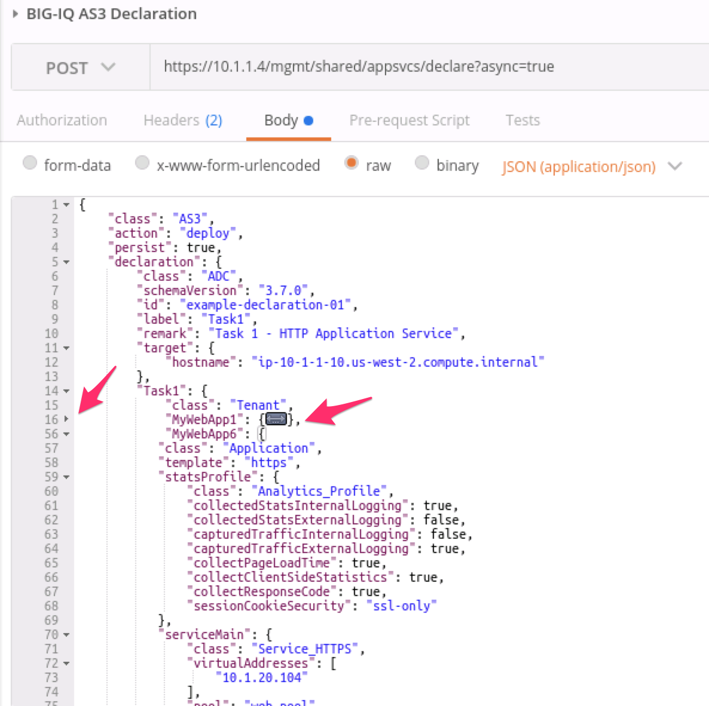

Lab 4.2: Modify AS3 Apps using BIG-IQ 6.1
-----------------------------------------

Using the declarative AS3 API, let's modfiy the HTTP application created during the previous **lab 1 - Task 1** through BIG-IQ:

Task 5 - Add HTTPS to existing HTTP AS3 Declaration
~~~~~~~~~~~~~~~~~~~~~~~~~~~~~~~~~~~~~~~~~~~~~~~~~~~

.. note:: Start with the previous AS3 Declaration from **lab 1 - Task 1**

#. Select the `4 HTTP and HTTPS virtual services in one declaration`_ from AS3 cloud docs and add application **A2** to the declaration using the AS3 public validator.

.. _4 HTTP and HTTPS virtual services in one declaration: https://clouddocs.f5.com/products/extensions/f5-appsvcs-extension/3/declarations/http-https.html#http-and-https-virtual-services-in-one-declaration

To access to the AS3 public validator, go to the Linux Jumphost, open a browser and connect to http://localhost:5000 (or use UDP public IP).

#. Click on ``Format JSON`` on the top left.

#. Click on ``Validate JSON`` and ``Validate AS3 Declaration``. Make sure the Declaration is valid!

#. Now that the JSON is validated, let's add the targetHost (BIG-IQ) and the traget (BIG-IP device)

Add target host information under the action::

    "targetHost": "10.1.1.4",
    "targetPort": 443,
    "targetUsername": "olivia",
    "targetPassphrase": "olivia",

Add the target information before the tenant application::

    "target": {
        "hostname": "ip-10-1-1-10.us-west-2.compute.internal"
    },

Modify the Virtual Address to 10.1.20.104 and the serverAddresses from 10.1.10.100 to 10.1.10.104.

#. Click on  ``Format JSON``, ``Validate JSON`` and ``Validate AS3 Declaration``. Make sure the Declaration is valid!

|lab-2-1|

#. Using Postman, use the **BIG-IQ AS3 Declaration** collection in order to create the service on the BIG-IP through BIG-IQ. Copy/Past the declaration into Postman.

    POST https://10.1.1.4/mgmt/shared/appsvcs/declare

.. note:: https://10.1.1.4/mgmt/shared/appsvcs/declare?async=true
          his will give you an ID which you can query in the task section 
          https://10.1.1.4/mgmt/shared/appsvcs/task/4ad9a50c-d3f6-4110-a26d-e7e100e38da9

Use the **BIG-IQ Check AS3 deployment** collection to ensure that the AS3 deployment is successfull without errors: 

    GET https://10.1.1.4/mgmt/cm/global/tasks/deploy-app-service

#. Logon on BIG-IQ, go to Application tab and check the application is displayed and analytics are showing.

