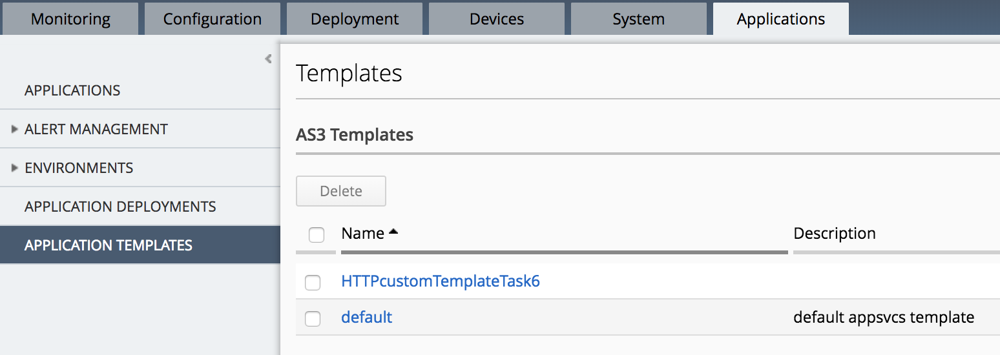
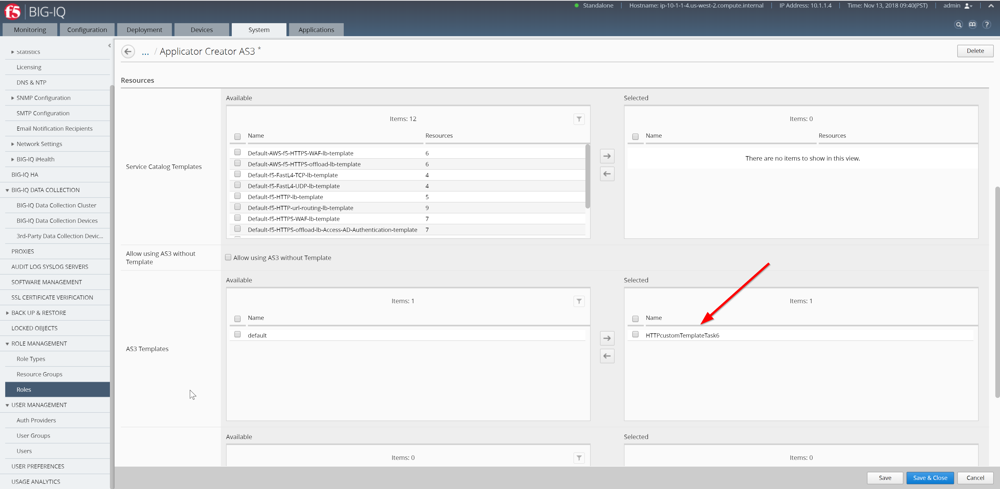

Lab 4.3: Deploying AS3 Templates with BIG-IQ 6.1
------------------------------------------------

Task 6 - Create custom HTTP AS3 Template on BIG-IQ
~~~~~~~~~~~~~~~~~~~~~~~~~~~~~~~~~~~~~~~~~~~~~~~~~~

#. Using Postman, copy the below example of an AS3 Template into  **BIG-IQ AS3 Template Creation** collection.
    it will create a new template in BIG-IQ AS3 Service Catalogue.

    POST https://10.1.1.4/mgmt/cm/global/appsvcs-templates

.. code-block:: yaml
   :linenos:

    {
        "description": "",
        "name": "HTTPcustomTemplateTask6",
        "schemaOverlay": {
            "type": "object",
            "properties": {
                "class": {},
                "updateMode": {},
                "schemaVersion": {},
                "id": {},
                "label": {},
                "remark": {},
                "constants": {},
                "Common": {},
                "controls": {},
                "scratch": {}
            },
            "required": [
                "class"
            ],
            "definitions": {
                "Pool": {
                    "loadBalancingMode": {
                        "type": "string",
                        "default": "round-robin"
                    },
                    "monitors": {
                        "type": "array"
                    },
                    "members": {
                        "type": "array"
                    }
                },
                "Service_HTTP": {
                    "virtualPort": {
                        "type": "integer",
                        "default": 8080,
                        "const": 8080
                    },
                    "virtualAddresses": {
                        "type": "array"
                    }
                }
            }
        }
    }

#. Logon on BIG-IQ, go to Application tab, then Application Templates. Look at the custom template created previous through the API.

|lab-3-1|

You can see the Template in JSON format if you click on it.

|lab-3-2|

Task 7 - Admin set RBAC for Olivia on BIG-IQ
~~~~~~~~~~~~~~~~~~~~~~~~~~~~~~~~~~~~~~~~~~~~

#. Logon on BIG-IQ as admin go to the System tab, Role Management, Roles, select **Applicator Creator AS3** 
and the custom role linked to the custom HTTP template previously created. Remove the **default** template from the allowed list.

|lab-3-3|

Task 8 - As Olivia, deploy the HTTP Application Service
~~~~~~~~~~~~~~~~~~~~~~~~~~~~~~~~~~~~~~~~~~~~~~~~~~~~~~~

#. Using Postman, update the user to olivia/olivia in the **BIG-IQ Token** collection.

#. Copy below example of an AS3 Declaration into the body of the **BIG-IQ AS3 Declaration** collection in order tocreate the service on the BIG-IP through BIG-IQ.
  
   POST https://10.1.1.4/mgmt/shared/appsvcs/declare?async=true

   This will give you an ID which you can query in the task section (as admin)
   
   https://10.1.1.4/mgmt/shared/appsvcs/task/4ad9a50c-d3f6-4110-a26d-e7e100e38da9

Modify the Virtual Address to 10.1.20.105 and the server Addresses to 10.1.10.111.

.. code-block:: yaml
   :linenos:
   :emphasize-lines: 7,35,47

    {
        "class": "AS3",
        "action": "deploy",
        "declaration": {
            "class": "ADC",
            "target": {
                "hostname": "<hostname>"
            },
            "schemaVersion": "3.7.0",
            "id": "isc-lab",
            "controls": {
                "class": "Controls",
                "logLevel": "debug"
            },
            "Task8": {
                "class": "Tenant",
                "A8": {
                    "class": "Application",
                    "schemaOverlay": "HTTPcustomTemplateTask6",
                    "template": "http",
                    "statsProfile": {
                        "class": "Analytics_Profile",
                        "collectedStatsInternalLogging": true,
                        "collectedStatsExternalLogging": false,
                        "capturedTrafficInternalLogging": false,
                        "capturedTrafficExternalLogging": true,
                        "collectPageLoadTime": true,
                        "collectClientSideStatistics": true,
                        "collectResponseCode": true,
                        "sessionCookieSecurity": "ssl-only"
                    },
                    "serviceMain": {
                        "class": "Service_HTTP",
                        "virtualAddresses": [
                            "<virtual>"
                        ],
                        "pool": "pool_8",
                        "profileAnalytics": {
                            "use": "statsProfile"
                        }
                    },
                    "pool_8": {
                        "class": "Pool",
                        "monitors": [
                            "http"
                        ],
                        "members": [
                            {
                                "serverAddresses": [
                                    "<node11>"
                                ],
                                "servicePort": 80
                            }
                        ]
                    }
                }
            }
        }
    }
    
Use the **BIG-IQ Check AS3 deployment** collection to ensure that the AS3 deployment is successfull without errors: 

    GET https://10.1.1.4/mgmt/cm/global/tasks/deploy-app-service

#. Logon on BIG-IP and verifiy the Application is correctly deployed.

#. Logon on BIG-IQ as Olivia, go to Application tab and check the application is displayed and analytics are showing.

|lab-3-4|

